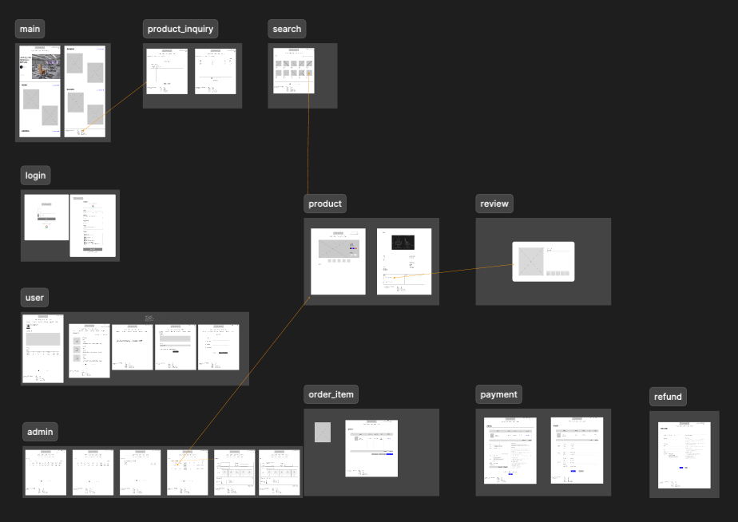
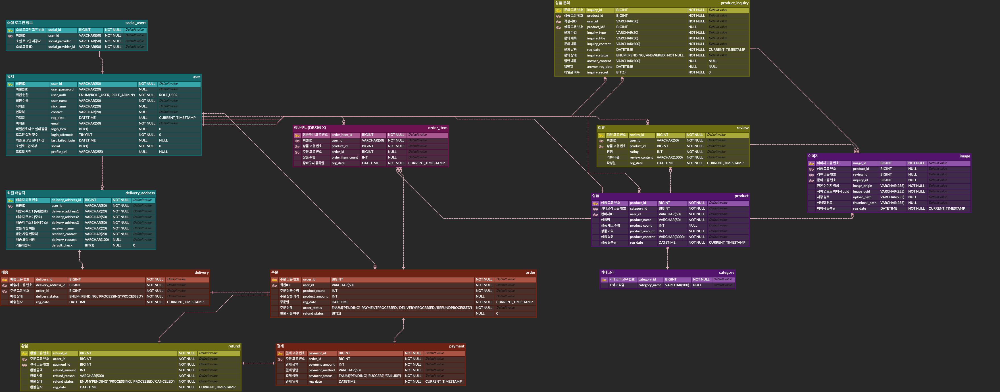

# SDZ

## 1. Project Overview
***
- 프로젝트 이름 : SDZ(사다줘)
- 프로젝트 설명 : 
  - 의자 전문 온라인 쇼핑몰
  - 관리자가 판매자인 B2C 모델

## 2. Features
***
### Core
- 상품
    - 서버
        - 상품 CRUD
    - 클라이언트
        - 상품상세/상품등록/수정
        - 상품목록(카테고리별)/상품목록(통합검색)
        - 어드민 페이지(상품 관리-목록)
- 주문
    - 서버
        - 주문 CRUD
    - 클라이언트
        - 주문 진행/주문 완료
        - 마이페이지(주문목록)
        - 어드민 페이지(주문 관리-목록)
- 회원
    - 서버
        - 회원 CRUD
    - 클라이언트
        - 로그인/회원가입
        - 마이 페이지(회원정보변경/배송지주소관리/탈퇴)
        - 어드민 페이지(회원관리-목록)
- 카테고리
    - 서버
        - 카테고리 CRUD
    - 클라이언트
        - 카테고리/메인화면
        - 어드민 페이지(카테고리관리-목록)
- 장바구니
    - 서버
        - 장바구니 CRUD
        - 첨부 파일
    - 클라이언트
        - 장바구니

### Advanced
- 리뷰
    - 서버
        - 리뷰 CRUD
    - 클라이언트
        - 리뷰 등록/수정 페이지
- 문의
    - 서버
        - 문의 CRUD
    - 클라이언트
        - 문의 등록/수정 페이지
- 환불
    - 서버
        - 환불 CRUD
    - 클라이언트
        - 환불 등록/수정 페이지
- 소셜 로그인
    - 기존에 구현한 구글을 제외한 다른 플랫폼 활용

## 3.Wireframe
***

- [figma](https://www.figma.com/design/gCf9nOPYvVuR7fzW98gave/2%EC%B0%A8-%ED%94%84%EB%A1%9C%EC%A0%9D%ED%8A%B8-%EC%99%80%EC%9D%B4%EC%96%B4-%ED%94%84%EB%A0%88%EC%9E%84?node-id=0-1&node-type=canvas&t=Jk42OHNCQ3LC68HO-0)

## 4.ERD
***

- [ERDCloud](https://www.erdcloud.com/d/tnhudChpccXNrdgkF)